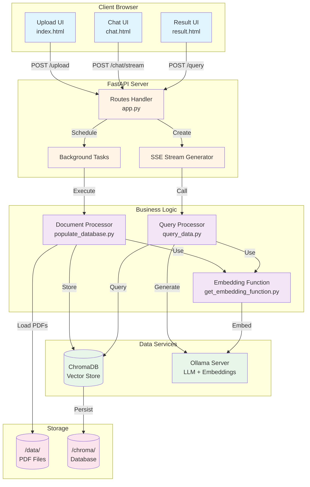
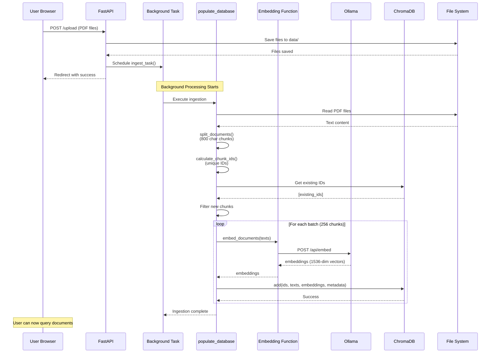
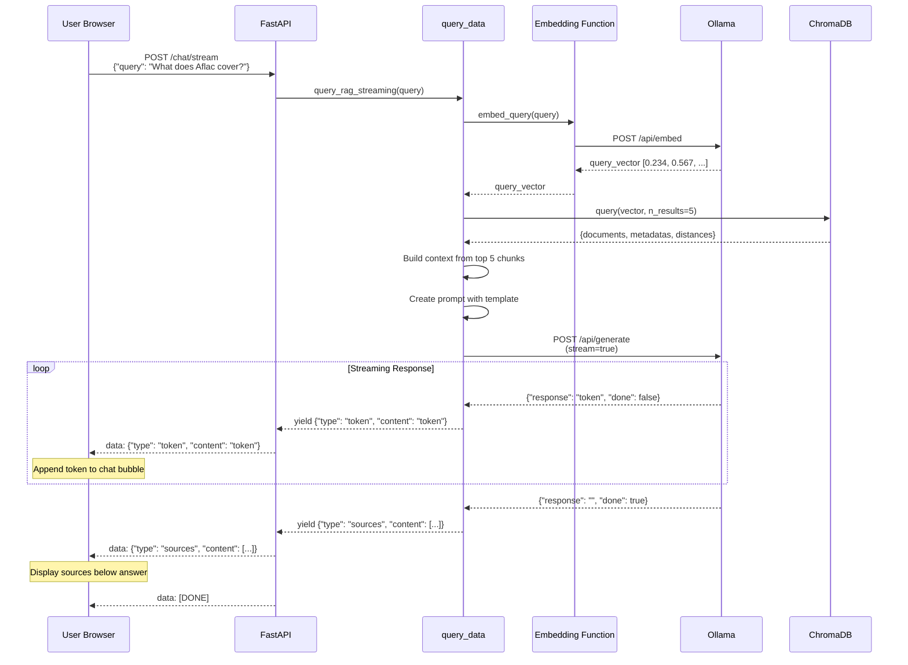
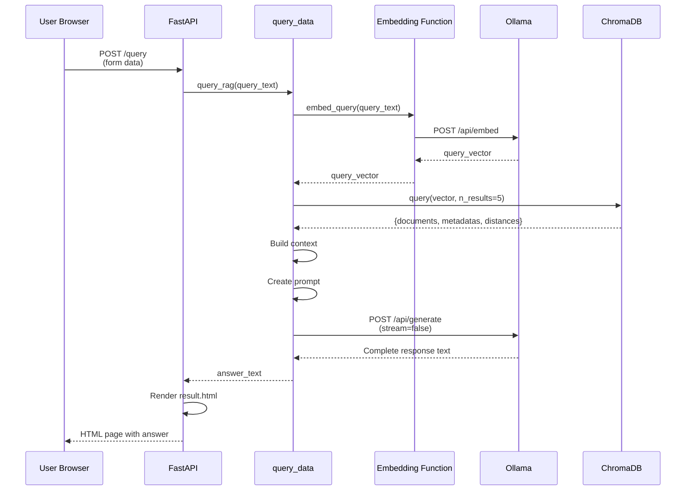
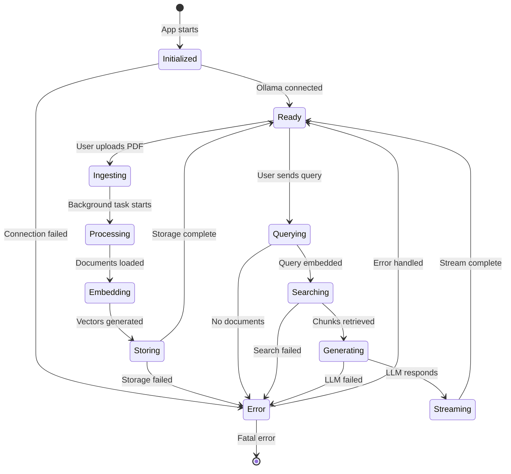

# 📊 Aflac Assist Chat - Architecture Diagrams

## Table of Contents
1. [System Architecture Diagram](#system-architecture-diagram)
2. [Component Interaction Diagram](#component-interaction-diagram)
3. [Sequence Diagrams](#sequence-diagrams)
4. [Data Flow Diagrams](#data-flow-diagrams)
5. [Deployment Architecture](#deployment-architecture)

---

## 1. System Architecture Diagram

### Multi-Layer Architecture

```
┌──────────────────────────────────────────────────────────────────────────┐
│                           PRESENTATION LAYER                              │
├──────────────────────────────────────────────────────────────────────────┤
│                                                                           │
│   ┌─────────────────┐  ┌──────────────────┐  ┌────────────────────┐     │
│   │  Upload UI      │  │   Simple Query   │  │   Chat Interface   │     │
│   │  (index.html)   │  │  (result.html)   │  │    (chat.html)     │     │
│   │                 │  │                  │  │                    │     │
│   │ • File picker   │  │ • Show answer    │  │ • Message bubbles  │     │
│   │ • Reset option  │  │ • Back button    │  │ • SSE streaming    │     │
│   │ • Status msgs   │  │                  │  │ • Source display   │     │
│   └────────┬────────┘  └────────┬─────────┘  └─────────┬──────────┘     │
│            │                    │                       │                │
└────────────┼────────────────────┼───────────────────────┼────────────────┘
             │                    │                       │
             │ POST /upload       │ POST /query           │ POST /chat/stream
             │                    │                       │
┌────────────┼────────────────────┼───────────────────────┼────────────────┐
│            ▼                    ▼                       ▼                │
│                              WEB LAYER                                   │
│  ┌───────────────────────────────────────────────────────────────────┐  │
│  │                      FastAPI Application                          │  │
│  │                           (app.py)                                │  │
│  │                                                                   │  │
│  │  ┌──────────────┐  ┌───────────────┐  ┌──────────────────────┐  │  │
│  │  │   Routes     │  │  Middleware   │  │  Background Tasks    │  │  │
│  │  ├──────────────┤  ├───────────────┤  ├──────────────────────┤  │  │
│  │  │ GET /        │  │ • CORS        │  │ • ingest_task()      │  │  │
│  │  │ GET /chat    │  │ • Logging     │  │ • Runs async         │  │  │
│  │  │ POST /upload │  │ • Exception   │  │ • Non-blocking       │  │  │
│  │  │ POST /query  │  │   handlers    │  │                      │  │  │
│  │  │ POST /chat/  │  │               │  │                      │  │  │
│  │  │   stream     │  │               │  │                      │  │  │
│  │  └──────┬───────┘  └───────────────┘  └──────────────────────┘  │  │
│  └─────────┼──────────────────────────────────────────────────────┘  │  │
│            │                                                           │
└────────────┼───────────────────────────────────────────────────────────┘
             │
             │ Calls business logic
             │
┌────────────┼───────────────────────────────────────────────────────────┐
│            ▼                  BUSINESS LOGIC LAYER                      │
├──────────────────────────────────────────────────────────────────────────┤
│                                                                          │
│  ┌────────────────────────────┐        ┌──────────────────────────────┐ │
│  │   Document Processing      │        │      Query Processing        │ │
│  │  (populate_database.py)    │        │      (query_data.py)         │ │
│  ├────────────────────────────┤        ├──────────────────────────────┤ │
│  │                            │        │                              │ │
│  │ ┌────────────────────────┐ │        │ ┌──────────────────────────┐ │ │
│  │ │ load_documents()       │ │        │ │ query_rag()              │ │ │
│  │ │ ───────────────────    │ │        │ │ ────────────             │ │ │
│  │ │ • Read PDFs            │ │        │ │ • Sync query             │ │ │
│  │ │ • Extract text         │ │        │ │ • Return full answer     │ │ │
│  │ │ • Create documents     │ │        │ │                          │ │ │
│  │ └────────────────────────┘ │        │ └──────────────────────────┘ │ │
│  │                            │        │                              │ │
│  │ ┌────────────────────────┐ │        │ ┌──────────────────────────┐ │ │
│  │ │ split_documents()      │ │        │ │ query_rag_streaming()    │ │ │
│  │ │ ───────────────────    │ │        │ │ ─────────────────────    │ │ │
│  │ │ • Chunk text (800ch)   │ │        │ │ • Async generator        │ │ │
│  │ │ • Overlap (80ch)       │ │        │ │ • Yields tokens          │ │ │
│  │ │ • Preserve context     │ │        │ │ • Real-time streaming    │ │ │
│  │ └────────────────────────┘ │        │ └──────────────────────────┘ │ │
│  │                            │        │                              │ │
│  │ ┌────────────────────────┐ │        │ ┌──────────────────────────┐ │ │
│  │ │ calculate_chunk_ids()  │ │        │ │ generate_with_ollama()   │ │ │
│  │ │ ───────────────────    │ │        │ │ ─────────────────────    │ │ │
│  │ │ • Unique IDs           │ │        │ │ • Call Ollama API        │ │ │
│  │ │ • Format: file:pg:ch   │ │        │ │ • Handle streaming       │ │ │
│  │ │ • Prevent duplicates   │ │        │ │ • Extract responses      │ │ │
│  │ └────────────────────────┘ │        │ └──────────────────────────┘ │ │
│  │                            │        │                              │ │
│  │ ┌────────────────────────┐ │        │                              │ │
│  │ │ add_to_chroma()        │ │        │                              │ │
│  │ │ ───────────────────    │ │        │                              │ │
│  │ │ • Batch processing     │ │        │                              │ │
│  │ │ • Skip existing        │ │        │                              │ │
│  │ │ • Store embeddings     │ │        │                              │ │
│  │ └────────────────────────┘ │        │                              │ │
│  └────────────┬───────────────┘        └──────────────┬───────────────┘ │
│               │                                       │                 │
└───────────────┼───────────────────────────────────────┼─────────────────┘
                │                                       │
                │ Uses embeddings                       │ Uses embeddings
                │                                       │
┌───────────────┼───────────────────────────────────────┼─────────────────┐
│               ▼                 EMBEDDING LAYER       ▼                 │
├──────────────────────────────────────────────────────────────────────────┤
│                                                                          │
│  ┌───────────────────────────────────────────────────────────────────┐  │
│  │              OllamaEmbeddingsWrapper                              │  │
│  │           (get_embedding_function.py)                             │  │
│  ├───────────────────────────────────────────────────────────────────┤  │
│  │                                                                   │  │
│  │  ┌─────────────────────────┐    ┌──────────────────────────────┐ │  │
│  │  │ embed_documents()       │    │ embed_query()                │ │  │
│  │  │ ───────────────────     │    │ ────────────                 │ │  │
│  │  │ Input: List[str]        │    │ Input: str                   │ │  │
│  │  │ Output: List[List[float]]│   │ Output: List[float]          │ │  │
│  │  │                         │    │                              │ │  │
│  │  │ • Batch processing      │    │ • Single query               │ │  │
│  │  │ • HTTP POST to Ollama   │    │ • Calls embed_documents()    │ │  │
│  │  │ • 1536 dimensions       │    │ • Returns first result       │ │  │
│  │  └─────────────────────────┘    └──────────────────────────────┘ │  │
│  │                                                                   │  │
│  │  Configuration:                                                   │  │
│  │    • Model: nomic-embed-text (default)                            │  │
│  │    • URL: http://127.0.0.1:11434 (configurable)                   │  │
│  └───────────────────────────┬───────────────────────────────────────┘  │
└────────────────────────────────┼──────────────────────────────────────────┘
                                 │
                                 │ HTTP Requests
                                 │
┌────────────────────────────────┼──────────────────────────────────────────┐
│                                ▼             DATA LAYER                  │
├──────────────────────────────────────────────────────────────────────────┤
│                                                                          │
│  ┌────────────────────────┐              ┌──────────────────────────┐   │
│  │     ChromaDB           │              │    Ollama Server         │   │
│  │  (Vector Database)     │              │   (LLM Service)          │   │
│  ├────────────────────────┤              ├──────────────────────────┤   │
│  │                        │              │                          │   │
│  │ Collection: documents  │              │ Models:                  │   │
│  │                        │              │                          │   │
│  │ ┌────────────────────┐ │              │ ┌──────────────────────┐ │   │
│  │ │ Storage:           │ │              │ │ nomic-embed-text     │ │   │
│  │ │ • IDs (unique)     │ │              │ │ ──────────────────   │ │   │
│  │ │ • Documents (text) │ │              │ │ • Embeddings         │ │   │
│  │ │ • Embeddings       │ │              │ │ • 1536 dimensions    │ │   │
│  │ │ • Metadata         │ │              │ │ • Fast inference     │ │   │
│  │ └────────────────────┘ │              │ └──────────────────────┘ │   │
│  │                        │              │                          │   │
│  │ ┌────────────────────┐ │              │ ┌──────────────────────┐ │   │
│  │ │ Operations:        │ │              │ │ mistral / llama3.2   │ │   │
│  │ │ • Add (batch)      │ │              │ │ ──────────────────   │ │   │
│  │ │ • Query (vector)   │ │              │ │ • Text generation    │ │   │
│  │ │ • Get (by ID)      │ │              │ │ • Context: 32K tokens│ │   │
│  │ │ • Delete           │ │              │ │ • Streaming support  │ │   │
│  │ └────────────────────┘ │              │ └──────────────────────┘ │   │
│  │                        │              │                          │   │
│  │ ┌────────────────────┐ │              │ API Endpoints:           │   │
│  │ │ Index: HNSW        │ │              │ • POST /api/embed        │   │
│  │ │ • O(log n) query   │ │              │ • POST /api/generate     │   │
│  │ │ • Cosine similarity│ │              │ • GET /api/tags          │   │
│  │ └────────────────────┘ │              │                          │   │
│  │                        │              │ Port: 11434              │   │
│  │ Path: ./chroma/        │              │                          │   │
│  └────────────────────────┘              └──────────────────────────┘   │
│                                                                          │
└──────────────────────────────────────────────────────────────────────────┘

                                    ↕
                          
┌──────────────────────────────────────────────────────────────────────────┐
│                          FILE SYSTEM LAYER                               │
├──────────────────────────────────────────────────────────────────────────┤
│                                                                          │
│  ┌────────────────┐        ┌─────────────────┐      ┌────────────────┐  │
│  │  data/         │        │  chroma/        │      │  templates/    │  │
│  │  (PDF Storage) │        │  (Vector DB)    │      │  (HTML Views)  │  │
│  ├────────────────┤        ├─────────────────┤      ├────────────────┤  │
│  │ • *.pdf files  │        │ • SQLite files  │      │ • index.html   │  │
│  │ • User uploads │        │ • Parquet files │      │ • chat.html    │  │
│  │ • Persistent   │        │ • Metadata      │      │ • result.html  │  │
│  └────────────────┘        └─────────────────┘      └────────────────┘  │
│                                                                          │
└──────────────────────────────────────────────────────────────────────────┘
```

---

## 2. Component Interaction Diagram



---

## 3. Sequence Diagrams

### 3.1 Document Upload Flow



### 3.2 Chat Query Flow (Streaming)



### 3.3 Simple Query Flow (Synchronous)



---

## 4. Data Flow Diagrams

### 4.1 Embedding Generation Flow

```
┌─────────────────────────────────────────────────────────────────┐
│                    TEXT INPUT                                    │
│  "Aflac provides accident insurance coverage..."                 │
└────────────────────────┬────────────────────────────────────────┘
                         │
                         ▼
┌─────────────────────────────────────────────────────────────────┐
│            get_embedding_function.py                             │
│   OllamaEmbeddingsWrapper.embed_documents([text])                │
└────────────────────────┬────────────────────────────────────────┘
                         │
                         ▼
┌─────────────────────────────────────────────────────────────────┐
│                  HTTP REQUEST                                    │
│  POST http://localhost:11434/api/embed                           │
│  Body: {                                                         │
│    "model": "nomic-embed-text",                                  │
│    "input": ["Aflac provides accident insurance coverage..."]    │
│  }                                                               │
└────────────────────────┬────────────────────────────────────────┘
                         │
                         ▼
┌─────────────────────────────────────────────────────────────────┐
│                   OLLAMA SERVER                                  │
│  1. Load model: nomic-embed-text                                 │
│  2. Tokenize input text                                          │
│  3. Pass through neural network                                  │
│  4. Generate 1536-dimensional vector                             │
└────────────────────────┬────────────────────────────────────────┘
                         │
                         ▼
┌─────────────────────────────────────────────────────────────────┐
│                  HTTP RESPONSE                                   │
│  {                                                               │
│    "embeddings": [                                               │
│      [0.234, 0.567, 0.123, ..., 0.891]  ← 1536 floats            │
│    ]                                                             │
│  }                                                               │
└────────────────────────┬────────────────────────────────────────┘
                         │
                         ▼
┌─────────────────────────────────────────────────────────────────┐
│                    VECTOR OUTPUT                                 │
│  [0.234, 0.567, 0.123, 0.456, 0.789, ..., 0.891]                 │
│                                                                  │
│  This vector captures semantic meaning and can be compared       │
│  with other vectors to find similar content                      │
└─────────────────────────────────────────────────────────────────┘
```

### 4.2 RAG Pipeline Flow

```
┌──────────────────────────────────────────────────────────────────────┐
│                        USER QUERY                                     │
│  "What are the benefits of Aflac accident insurance?"                │
└────────────────────────────┬─────────────────────────────────────────┘
                             │
                             ▼
┌─────────────────────────────────────────────────────────────────────┐
│ STEP 1: EMBED QUERY                                                 │
│ ─────────────────────────────────────────────────────────────────── │
│ Input: "What are the benefits..."                                   │
│ Output: [0.245, 0.583, 0.129, ..., 0.777] (1536 dims)               │
└────────────────────────────┬────────────────────────────────────────┘
                             │
                             ▼
┌─────────────────────────────────────────────────────────────────────┐
│ STEP 2: VECTOR SIMILARITY SEARCH                                    │
│ ─────────────────────────────────────────────────────────────────── │
│ ChromaDB compares query vector with all stored document vectors     │
│                                                                      │
│ Query Vector: [0.245, 0.583, 0.129, ...]                            │
│      ↓ Compare (cosine similarity)                                  │
│ Database:                                                            │
│   Chunk #1234: [0.244, 0.582, 0.130, ...]  → Distance: 0.08 ✓       │
│   Chunk #5678: [0.890, 0.012, 0.567, ...]  → Distance: 0.92         │
│   Chunk #9012: [0.246, 0.580, 0.128, ...]  → Distance: 0.09 ✓       │
│   ... (thousands more)                                               │
│                                                                      │
│ Returns: Top 5 most similar chunks                                  │
└────────────────────────────┬────────────────────────────────────────┘
                             │
                             ▼
┌─────────────────────────────────────────────────────────────────────┐
│ STEP 3: RETRIEVE DOCUMENT CHUNKS                                    │
│ ─────────────────────────────────────────────────────────────────── │
│ Chunk 1 (distance: 0.08):                                           │
│   "Aflac accident insurance provides cash benefits for covered      │
│    injuries including fractures, dislocations, and lacerations..."  │
│   Source: data/policy.pdf:12                                        │
│                                                                      │
│ Chunk 2 (distance: 0.09):                                           │
│   "Benefits are paid directly to you, not the hospital, giving      │
│    you flexibility to use the money for medical bills..."           │
│   Source: data/policy.pdf:14                                        │
│                                                                      │
│ Chunk 3 (distance: 0.12):                                           │
│   "Coverage includes emergency room visits, ambulance services,     │
│    and follow-up care with customizable benefit amounts..."         │
│   Source: data/policy.pdf:15                                        │
│                                                                      │
│ [+ 2 more chunks]                                                   │
└────────────────────────────┬────────────────────────────────────────┘
                             │
                             ▼
┌─────────────────────────────────────────────────────────────────────┐
│ STEP 4: BUILD CONTEXT                                               │
│ ─────────────────────────────────────────────────────────────────── │
│ context_text = chunk1 + "\n\n---\n\n" + chunk2 + "\n\n---\n\n" ...  │
└────────────────────────────┬────────────────────────────────────────┘
                             │
                             ▼
┌─────────────────────────────────────────────────────────────────────┐
│ STEP 5: CREATE PROMPT                                               │
│ ─────────────────────────────────────────────────────────────────── │
│ Answer the question based only on the following context:            │
│                                                                      │
│ [context from chunks above]                                         │
│                                                                      │
│ ---                                                                  │
│                                                                      │
│ Answer the question based on the above context:                     │
│ What are the benefits of Aflac accident insurance?                  │
└────────────────────────────┬────────────────────────────────────────┘
                             │
                             ▼
┌─────────────────────────────────────────────────────────────────────┐
│ STEP 6: LLM GENERATION                                              │
│ ─────────────────────────────────────────────────────────────────── │
│ Send prompt to Ollama (mistral/llama3.2)                            │
│                                                                      │
│ LLM reads context and generates answer:                             │
│ "Based on the documents, Aflac accident insurance provides several  │
│  benefits: 1) Cash payments directly to you for covered injuries    │
│  like fractures and dislocations, 2) Flexibility to use funds for   │
│  medical bills or other expenses, 3) Coverage for emergency room    │
│  visits and ambulance services..."                                  │
└────────────────────────────┬────────────────────────────────────────┘
                             │
                             ▼
┌─────────────────────────────────────────────────────────────────────┐
│ STEP 7: RETURN RESPONSE                                             │
│ ─────────────────────────────────────────────────────────────────── │
│ {                                                                    │
│   "answer": "Based on the documents, Aflac accident insurance...",  │
│   "sources": [                                                       │
│     {"rank": 1, "source": "policy.pdf:12", "distance": 0.08},       │
│     {"rank": 2, "source": "policy.pdf:14", "distance": 0.09},       │
│     ...                                                              │
│   ]                                                                  │
│ }                                                                    │
└─────────────────────────────────────────────────────────────────────┘
```

---

## 5. Deployment Architecture

### 5.1 Local Development

```
┌─────────────────────────────────────────────────────────────┐
│                    Developer Machine                         │
│  (Windows / macOS / Linux)                                   │
├─────────────────────────────────────────────────────────────┤
│                                                              │
│  ┌────────────────────────────────────────────────────┐     │
│  │  Terminal 1: Ollama Server                         │     │
│  │  $ ollama serve                                     │     │
│  │  Listening on 127.0.0.1:11434                       │     │
│  └────────────────────────────────────────────────────┘     │
│                                                              │
│  ┌────────────────────────────────────────────────────┐     │
│  │  Terminal 2: FastAPI App                           │     │
│  │  $ .venv\Scripts\Activate.ps1                       │     │
│  │  $ python -m uvicorn app:app --reload --port 8000  │     │
│  │  Listening on 127.0.0.1:8000                        │     │
│  └────────────────────────────────────────────────────┘     │
│                                                              │
│  ┌────────────────────────────────────────────────────┐     │
│  │  Browser                                            │     │
│  │  http://localhost:8000                              │     │
│  │  http://localhost:8000/chat                         │     │
│  └────────────────────────────────────────────────────┘     │
│                                                              │
│  File System:                                                │
│    ./data/          ← PDF files                              │
│    ./chroma/        ← Vector database                        │
│    ./templates/     ← HTML templates                         │
└─────────────────────────────────────────────────────────────┘
```

### 5.2 Docker Deployment

```
┌────────────────────────────────────────────────────────────────┐
│                      Docker Host                               │
├────────────────────────────────────────────────────────────────┤
│                                                                │
│  ┌──────────────────────────────────────────────────────────┐ │
│  │              Docker Network: aflac-net                   │ │
│  │                                                          │ │
│  │  ┌─────────────────────┐    ┌──────────────────────┐    │ │
│  │  │  Container: app     │    │ Container: ollama    │    │ │
│  │  ├─────────────────────┤    ├──────────────────────┤    │ │
│  │  │ Image: python:3.11  │    │ Image: ollama/ollama │    │ │
│  │  │ Port: 8000:8000     │    │ Port: 11434:11434    │    │ │
│  │  │                     │    │                      │    │ │
│  │  │ FastAPI App         │◄───┤ Ollama Server        │    │ │
│  │  │ • app.py            │    │ • nomic-embed-text   │    │ │
│  │  │ • Routes            │    │ • mistral            │    │ │
│  │  │ • Business logic    │    │                      │    │ │
│  │  │                     │    │                      │    │ │
│  │  │ Volumes:            │    │ Volumes:             │    │ │
│  │  │ • ./data:/app/data  │    │ • ollama_data:/root/ │    │ │
│  │  │ • ./chroma:/chroma  │    │   .ollama            │    │ │
│  │  └─────────────────────┘    └──────────────────────┘    │ │
│  │           ▲                                              │ │
│  │           │                                              │ │
│  └───────────┼──────────────────────────────────────────────┘ │
│              │                                                │
│              │ HTTP                                           │
│              │                                                │
└──────────────┼────────────────────────────────────────────────┘
               │
               │ Port Mapping
               │
┌──────────────┼────────────────────────────────────────────────┐
│              ▼                                                 │
│         Host Network                                           │
│         Port: 8000 → Container: 8000                           │
│                                                                │
│         ┌────────────────────────────────┐                     │
│         │  External User Browser         │                     │
│         │  http://host-ip:8000           │                     │
│         └────────────────────────────────┘                     │
└────────────────────────────────────────────────────────────────┘
```

### 5.3 Production Cloud Deployment (Azure)

```
┌───────────────────────────────────────────────────────────────────┐
│                         AZURE CLOUD                               │
├───────────────────────────────────────────────────────────────────┤
│                                                                   │
│  ┌─────────────────────────────────────────────────────────────┐ │
│  │               Azure Virtual Network                         │ │
│  │                                                             │ │
│  │  ┌────────────────────────────────────────────────────┐    │ │
│  │  │   Subnet: Application Tier                        │    │ │
│  │  │                                                    │    │ │
│  │  │  ┌──────────────────────────────────────────┐     │    │ │
│  │  │  │  Azure App Service                       │     │    │ │
│  │  │  │  (Linux, Python 3.11)                    │     │    │ │
│  │  │  ├──────────────────────────────────────────┤     │    │ │
│  │  │  │  • FastAPI Application                   │     │    │ │
│  │  │  │  • Auto-scaling (2-10 instances)         │     │    │ │
│  │  │  │  • SSL/TLS enabled                       │     │    │ │
│  │  │  │  • Custom domain: chat.aflac.com         │     │    │ │
│  │  │  └──────────────────────────────────────────┘     │    │ │
│  │  │                                                    │    │ │
│  │  └────────────────────────────────────────────────────┘    │ │
│  │                                                             │ │
│  │  ┌────────────────────────────────────────────────────┐    │ │
│  │  │   Subnet: AI Services                             │    │ │
│  │  │                                                    │    │ │
│  │  │  ┌──────────────────────────────────────────┐     │    │ │
│  │  │  │  Azure VM (Standard_NC6)                 │     │    │ │
│  │  │  │  GPU-enabled for Ollama                  │     │    │ │
│  │  │  ├──────────────────────────────────────────┤     │    │ │
│  │  │  │  • Ubuntu 22.04                          │     │    │ │
│  │  │  │  • Ollama Server                         │     │    │ │
│  │  │  │  • Models: nomic-embed-text, mistral     │     │    │ │
│  │  │  │  • Private IP only                       │     │    │ │
│  │  │  └──────────────────────────────────────────┘     │    │ │
│  │  │                                                    │    │ │
│  │  └────────────────────────────────────────────────────┘    │ │
│  │                                                             │ │
│  └─────────────────────────────────────────────────────────────┘ │
│                                                                   │
│  ┌─────────────────────────────────────────────────────────────┐ │
│  │               Azure Storage Services                        │ │
│  │                                                             │ │
│  │  ┌────────────────────┐      ┌────────────────────────┐    │ │
│  │  │ Azure Blob Storage │      │ Azure Files            │    │ │
│  │  ├────────────────────┤      ├────────────────────────┤    │ │
│  │  │ • PDF documents    │      │ • ChromaDB storage     │    │ │
│  │  │ • Hot tier         │      │ • Mounted as volume    │    │ │
│  │  │ • Private access   │      │ • SMB protocol         │    │ │
│  │  └────────────────────┘      └────────────────────────┘    │ │
│  │                                                             │ │
│  └─────────────────────────────────────────────────────────────┘ │
│                                                                   │
│  ┌─────────────────────────────────────────────────────────────┐ │
│  │            Azure Monitor & Application Insights             │ │
│  │  • Logs, Metrics, Traces                                    │ │
│  │  • Alert rules                                              │ │
│  │  • Dashboard                                                │ │
│  └─────────────────────────────────────────────────────────────┘ │
│                                                                   │
└────────────────────────────────┬──────────────────────────────────┘
                                 │
                                 │ HTTPS (443)
                                 │
┌────────────────────────────────┼──────────────────────────────────┐
│                                ▼                                   │
│                      Azure Front Door                              │
│                (CDN + WAF + Load Balancer)                         │
│  • SSL Termination                                                 │
│  • DDoS Protection                                                 │
│  • Geo-distribution                                                │
└────────────────────────────────┬──────────────────────────────────┘
                                 │
                                 │ HTTPS
                                 │
┌────────────────────────────────┼──────────────────────────────────┐
│                                ▼                                   │
│                      Internet Users                                │
│                 https://chat.aflac.com                             │
└───────────────────────────────────────────────────────────────────┘
```

---

## 6. Network Flow Diagram

### Request/Response Flow

```
┌─────────────┐
│   Browser   │
└──────┬──────┘
       │
       │ 1. HTTPS Request
       │    POST /chat/stream
       │    {"query": "..."}
       ▼
┌─────────────────────┐
│   Load Balancer     │
│   (Port 443/80)     │
└──────┬──────────────┘
       │
       │ 2. Forward to app
       │    Port 8000
       ▼
┌─────────────────────┐
│   FastAPI Server    │
│   (app.py)          │
│                     │
│   3. Parse request  │
│   4. Call business  │
│      logic          │
└──────┬──────────────┘
       │
       │ 5. Query vector DB
       │    (Internal network)
       ▼
┌─────────────────────┐
│   ChromaDB          │
│   (Port: internal)  │
│                     │
│   6. Vector search  │
│   7. Return chunks  │
└──────┬──────────────┘
       │
       │ 8. Results
       │
┌──────┴──────────────┐
│   FastAPI Server    │
│                     │
│   9. Build prompt   │
└──────┬──────────────┘
       │
       │ 10. Generate request
       │     POST /api/generate
       ▼
┌─────────────────────┐
│   Ollama Server     │
│   (Port 11434)      │
│                     │
│   11. Stream tokens │
└──────┬──────────────┘
       │
       │ 12. Stream response
       │     (SSE)
       ▼
┌─────────────────────┐
│   FastAPI Server    │
│                     │
│   13. Format SSE    │
│   14. Stream back   │
└──────┬──────────────┘
       │
       │ 15. SSE Stream
       │     data: {...}
       ▼
┌─────────────────────┐
│   Load Balancer     │
└──────┬──────────────┘
       │
       │ 16. Forward stream
       ▼
┌─────────────┐
│   Browser   │
│             │
│   17. Render│
│      tokens │
└─────────────┘
```

---

## 7. State Diagram

### Application State Machine



---

## 8. Technology Stack Diagram

```
┌────────────────────────────────────────────────────────────────┐
│                      FRONTEND LAYER                            │
├────────────────────────────────────────────────────────────────┤
│  HTML5  │  CSS3  │  JavaScript (ES6+)  │  Fetch API  │  SSE   │
└────────────────────────────────────────────────────────────────┘
                               │
                               │ HTTP/HTTPS
                               │
┌────────────────────────────────────────────────────────────────┐
│                       WEB FRAMEWORK                            │
├────────────────────────────────────────────────────────────────┤
│  FastAPI 0.110.0  │  Uvicorn 0.30.0+  │  Jinja2 3.1.4         │
│  Python 3.11+     │  Pydantic         │  Starlette             │
└────────────────────────────────────────────────────────────────┘
                               │
                               │ Python Imports
                               │
┌────────────────────────────────────────────────────────────────┐
│                    BUSINESS LOGIC LAYER                        │
├────────────────────────────────────────────────────────────────┤
│  Custom Python Modules:                                        │
│  • populate_database.py                                        │
│  • query_data.py                                               │
│  • get_embedding_function.py                                   │
└────────────────────────────────────────────────────────────────┘
                               │
                ┌──────────────┼──────────────┐
                │              │              │
                ▼              ▼              ▼
┌─────────────────┐  ┌─────────────────┐  ┌─────────────────┐
│   PDF PARSING   │  │  VECTOR DB      │  │   LLM SERVICE   │
├─────────────────┤  ├─────────────────┤  ├─────────────────┤
│ pypdf 3.17.0    │  │ ChromaDB 0.4.15 │  │ Ollama          │
│                 │  │                 │  │ • nomic-embed   │
│ • Text extract  │  │ • HNSW index    │  │ • mistral       │
│ • Page parsing  │  │ • Cosine sim    │  │ • llama3.2      │
│                 │  │ • Persist       │  │                 │
└─────────────────┘  └─────────────────┘  └─────────────────┘
                               │
                               │ HTTP Client
                               │
┌────────────────────────────────────────────────────────────────┐
│                     HTTP CLIENT LAYER                          │
├────────────────────────────────────────────────────────────────┤
│  Requests 2.32.3  │  Async/Await  │  Streaming Support        │
└────────────────────────────────────────────────────────────────┘
                               │
                               │ OS/Network
                               │
┌────────────────────────────────────────────────────────────────┐
│                    INFRASTRUCTURE LAYER                        │
├────────────────────────────────────────────────────────────────┤
│  Operating System: Windows / Linux / macOS                     │
│  Python Runtime: 3.11+                                         │
│  File System: data/ (PDFs), chroma/ (Vector DB)                │
│  Network: TCP/IP, HTTP/1.1, WebSockets                         │
└────────────────────────────────────────────────────────────────┘
```

---

## 9. Security Architecture

```
┌─────────────────────────────────────────────────────────────────┐
│                        SECURITY LAYERS                           │
└─────────────────────────────────────────────────────────────────┘

┌─────────────────────────────────────────────────────────────────┐
│ Layer 1: Network Security                                       │
├─────────────────────────────────────────────────────────────────┤
│  ☐ Firewall Rules (Not implemented)                             │
│  ☐ SSL/TLS (Not implemented)                                    │
│  ☐ DDoS Protection (Not implemented)                            │
│  ✓ Local-only access (default: 127.0.0.1)                       │
└─────────────────────────────────────────────────────────────────┘

┌─────────────────────────────────────────────────────────────────┐
│ Layer 2: Application Security                                   │
├─────────────────────────────────────────────────────────────────┤
│  ☐ Authentication (Not implemented)                             │
│  ☐ Authorization (Not implemented)                              │
│  ☐ Rate Limiting (Not implemented)                              │
│  ☐ Input Validation (Partial)                                   │
│  ☐ CSRF Protection (Not implemented)                            │
│  ✓ Exception Handling (Implemented)                             │
└─────────────────────────────────────────────────────────────────┘

┌─────────────────────────────────────────────────────────────────┐
│ Layer 3: Data Security                                          │
├─────────────────────────────────────────────────────────────────┤
│  ☐ Encryption at Rest (Not implemented)                         │
│  ☐ Encryption in Transit (Not implemented)                      │
│  ✓ Local Storage (ChromaDB files)                               │
│  ✓ No External Data Transmission                                │
│  ☐ Data Sanitization (Partial)                                  │
└─────────────────────────────────────────────────────────────────┘

┌─────────────────────────────────────────────────────────────────┐
│ Layer 4: AI/ML Security                                         │
├─────────────────────────────────────────────────────────────────┤
│  ✓ Prompt Injection Prevention (Template-based)                 │
│  ✓ Context Limitation (5 chunks max)                            │
│  ☐ Output Filtering (Not implemented)                           │
│  ✓ Local Model Execution (Ollama)                               │
│  ✓ No External API Calls (Privacy preserved)                    │
└─────────────────────────────────────────────────────────────────┘

Legend:
  ✓ Implemented
  ☐ Not Implemented (Recommended for Production)
```

---

## 10. Performance Metrics

```
┌─────────────────────────────────────────────────────────────────┐
│                    PERFORMANCE BENCHMARKS                        │
└─────────────────────────────────────────────────────────────────┘

┌─────────────────────────────────────────────────────────────────┐
│ Operation: PDF Upload & Ingestion                               │
├─────────────────────────────────────────────────────────────────┤
│  File Size: 1 MB (10 pages)                                     │
│  • Read & Parse:        ~200ms                                  │
│  • Split into Chunks:   ~50ms (12 chunks)                       │
│  • Generate Embeddings: ~1.2s (12 chunks × 100ms)               │
│  • Store in ChromaDB:   ~150ms                                  │
│  ─────────────────────────────────────────                      │
│  Total Time:            ~1.6 seconds                            │
└─────────────────────────────────────────────────────────────────┘

┌─────────────────────────────────────────────────────────────────┐
│ Operation: Query Processing                                      │
├─────────────────────────────────────────────────────────────────┤
│  Query: "What does Aflac cover?"                                │
│  • Embed Query:         ~100ms                                  │
│  • Vector Search:       ~50ms (1000 chunks in DB)               │
│  • Retrieve Chunks:     ~20ms                                   │
│  • Build Prompt:        ~5ms                                    │
│  • LLM Generation:      ~2-5s (depends on response length)      │
│  ─────────────────────────────────────────                      │
│  Total Time:            ~2.2-5.2 seconds                        │
└─────────────────────────────────────────────────────────────────┘

┌─────────────────────────────────────────────────────────────────┐
│ Streaming Performance                                            │
├─────────────────────────────────────────────────────────────────┤
│  • First Token Latency:  ~200ms                                 │
│  • Token Generation:     50-100 tokens/second                   │
│  • Network Overhead:     ~5-10ms per chunk                      │
│  • Full Response (200 tokens): ~2-4 seconds                     │
└─────────────────────────────────────────────────────────────────┘

┌─────────────────────────────────────────────────────────────────┐
│ Scalability Limits                                               │
├─────────────────────────────────────────────────────────────────┤
│  • Max PDF Size:         No hard limit (memory dependent)       │
│  • Max Chunks in DB:     ~1M (performance degrades after 100K)  │
│  • Concurrent Users:     ~10-20 (single instance)               │
│  • Memory Usage:         ~500MB base + ~1MB per 1000 chunks     │
│  • Disk Usage (Chroma):  ~1KB per chunk (avg)                   │
└─────────────────────────────────────────────────────────────────┘

---

## 11. Chat History & State Management

### 11.1 Current Implementation (No Persistence)

```
┌─────────────────────────────────────────────────────────────────┐
│                    BROWSER SESSION STATE                         │
│                  (chat.html - JavaScript)                        │
└─────────────────────────────────────────────────────────────────┘

┌─────────────────────────────────────────────────────────────────┐
│  JavaScript Variables (In-Memory Only)                          │
├─────────────────────────────────────────────────────────────────┤
│                                                                 │
│  let messages = [];  ← LOST ON PAGE REFRESH ❌                  │
│                                                                 │
│  Structure:                                                     │
│  [                                                              │
│    {                                                            │
│      role: "user",                                             │
│      content: "What does Aflac cover?",                        │
│      timestamp: "2024-01-15T10:30:00Z"                         │
│    },                                                           │
│    {                                                            │
│      role: "assistant",                                        │
│      content: "Based on the documents...",                     │
│      sources: [{rank: 1, source: "...", distance: 0.08}],      │
│      timestamp: "2024-01-15T10:30:05Z"                         │
│    }                                                            │
│  ]                                                              │
│                                                                 │
│  Lifecycle:                                                     │
│  ✓ Created: Page load                                          │
│  ✓ Updated: Each query/response                                │
│  ✗ Persisted: NO - cleared on refresh/close                    │
└─────────────────────────────────────────────────────────────────┘

         When User Refreshes Page:
                  ▼
┌─────────────────────────────────────────────────────────────────┐
│                      ❌ ALL HISTORY LOST                         │
│  • messages array cleared                                       │
│  • Chat UI reset to empty state                                 │
│  • No recovery possible                                         │
└─────────────────────────────────────────────────────────────────┘
```

### 11.2 Proposed Solution: LocalStorage Persistence

#### Implementation Diagram

```
┌──────────────────────────────────────────────────────────────────┐
│                        CHAT LIFECYCLE                            │
└──────────────────────────────────────────────────────────────────┘

1. PAGE LOAD
   ┌────────────────┐
   │ Browser starts │
   └───────┬────────┘
           │
           ▼
   ┌──────────────────────────────────────────────┐
   │ JavaScript: loadChatHistory()                │
   │ const saved = localStorage.getItem('chat')   │
   ├──────────────────────────────────────────────┤
   │ If found: Restore messages[]                 │
   │ If not:   messages = []                      │
   └──────────┬───────────────────────────────────┘
              │
              ▼
   ┌──────────────────────────────────┐
   │ Render restored conversation     │
   └──────────────────────────────────┘

2. USER SENDS MESSAGE
   ┌────────────────┐
   │ User types     │
   │ "What..."      │
   └───────┬────────┘
           │
           ▼
   ┌──────────────────────────────────────────────┐
   │ Add to messages[]                            │
   │ localStorage.setItem('chat', JSON.stringify) │
   └──────────┬───────────────────────────────────┘
              │
              ▼
   ┌──────────────────────────────────┐
   │ Send to /chat/stream             │
   └──────────────────────────────────┘

3. ASSISTANT RESPONDS
   ┌────────────────┐
   │ Stream tokens  │
   └───────┬────────┘
           │
           ▼
   ┌──────────────────────────────────────────────┐
   │ Build response message                       │
   │ Add to messages[]                            │
   │ localStorage.setItem('chat', JSON.stringify) │
   └──────────┬───────────────────────────────────┘
              │
              ▼
   ┌──────────────────────────────────┐
   │ Display in chat UI               │
   └──────────────────────────────────┘

4. PAGE REFRESH
   ┌────────────────┐
   │ User refreshes │
   │ (F5)           │
   └───────┬────────┘
           │
           ▼
   ┌──────────────────────────────────┐
   │ ✓ LocalStorage preserved         │
   │ ✓ Load from storage              │
   │ ✓ Chat history restored!         │
   └──────────────────────────────────┘
```

#### Code Implementation
  ✓ Implemented
  ☐ Not Implemented (Recommended for Production)
```

---

## 10. Performance Metrics

```
┌─────────────────────────────────────────────────────────────────┐
│                    PERFORMANCE BENCHMARKS                        │
└─────────────────────────────────────────────────────────────────┘

┌─────────────────────────────────────────────────────────────────┐
│ Operation: PDF Upload & Ingestion                               │
├─────────────────────────────────────────────────────────────────┤
│  File Size: 1 MB (10 pages)                                     │
│  • Read & Parse:        ~200ms                                  │
│  • Split into Chunks:   ~50ms (12 chunks)                       │
│  • Generate Embeddings: ~1.2s (12 chunks × 100ms)               │
│  • Store in ChromaDB:   ~150ms                                  │
│  ─────────────────────────────────────────                      │
│  Total Time:            ~1.6 seconds                            │
└─────────────────────────────────────────────────────────────────┘

┌─────────────────────────────────────────────────────────────────┐
│ Operation: Query Processing                                      │
├─────────────────────────────────────────────────────────────────┤
│  Query: "What does Aflac cover?"                                │
│  • Embed Query:         ~100ms                                  │
│  • Vector Search:       ~50ms (1000 chunks in DB)               │
│  • Retrieve Chunks:     ~20ms                                   │
│  • Build Prompt:        ~5ms                                    │
│  • LLM Generation:      ~2-5s (depends on response length)      │
│  ─────────────────────────────────────────                      │
│  Total Time:            ~2.2-5.2 seconds                        │
└─────────────────────────────────────────────────────────────────┘

┌─────────────────────────────────────────────────────────────────┐
│ Streaming Performance                                            │
├─────────────────────────────────────────────────────────────────┤
│  • First Token Latency:  ~200ms                                 │
│  • Token Generation:     50-100 tokens/second                   │
│  • Network Overhead:     ~5-10ms per chunk                      │
│  • Browser Rendering:    ~1-2ms per token                       │
└─────────────────────────────────────────────────────────────────┘

┌─────────────────────────────────────────────────────────────────┐
│ Scalability Metrics                                              │
├─────────────────────────────────────────────────────────────────┤
│  Database Size:         10,000 chunks                            │
│  • Query Time:          ~50-100ms (sub-linear with HNSW)        │
│  • Storage Size:        ~15 MB (embeddings) + chunks            │
│                                                                  │
│  Concurrent Users:      10                                       │
│  • Response Time:       ~2.5s (avg, no queuing)                 │
│  • Bottleneck:          Ollama LLM (single GPU)                  │
└─────────────────────────────────────────────────────────────────┘
```

---

**Document:** Architecture Diagrams  
**Version:** 1.0  
**Last Updated:** 2024  
**Project:** Aflac Assist Chat  
**Author:** Somansh Shekhar
